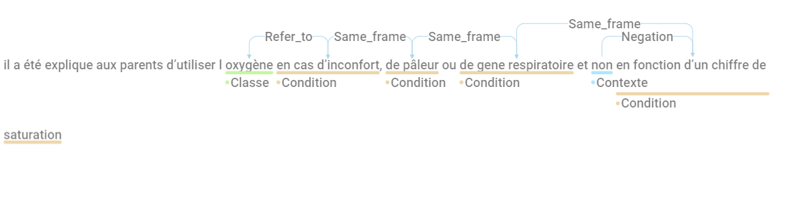
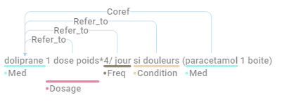

# Guide d'annotation

Pour chaque rapport de patient fourni, l'objectif est d'extraire des
informations sur tous les médicaments qui sont connus pour être pris par
le patient ou liés à lui, différents attributs des médicaments et la
temporalité en relation ou non avec les médicaments..

L'ensemble de la tâche d'annotation sera centrée sur les médicaments
mais l'ensemble des concepts suivant doit être annoté ou corrigé (à
partir de la préannotation) dans le document :

-   [Médicament ou Classe de médicament](#médicament-ou-classe-de-médicaments) : **"drug"**, **"class"**

-  [Dose](#dose-dose) : **"dose"** (en relation ou non avec un médicament)

-   [Fréquence](#fréquence-freq) : **"freq"** (en relation ou non avec un médicament)

-   [Durée](#durée-duree)  : **"duration"** (en relation ou non avec un médicament)

-   [Voie d'administration](#voie-dadministration-route) : **"route"** (en relation ou non avec un
    médicament)

-   [Condition](#condition-condition) : **"condition"** (en relation ou non avec un médicament)

-   [Date]("#date-date") : **"date"** (en relation ou non avec un médicament)

Le deuxième objectif est d'extraire les relations entre ces annotations
et les médicaments, l'ensemble des relations suivantes nécessite d'être
annoté :

-   ["start"](#start) : entre une **"date"** et un **"drug"** ou **"class"**

-   ["stop"](#stop): entre une **"date"** et **"drug"** ou **"class"**

-   ["duration_presc"](#duree-prescription) : entre une **"duration"** et **"drug"** ou **"class"**

-   ["duration_admin"](#duree-administration) : entre une **"duration"** et **"drug"** ou **"class"** IV

-   ["refer_to"](#relation-simple) : entre une **"dose"**, une **"route"**, une **"freq"** ou une
    **"condition"** et un **"drug"** ou **"class"**

Le dernier objectif est d'extraire les relations temporelle : arrivé à
replacer les entité temporelle les unes par rapport aux autres si elles
sont relatives. <!--# Vraiment? peut-être utopique --->

Si une entité est disjointe, la relation : **"same_ent"** doit être
utilisé entre les deux parties de l'entité. Si un médicament est répété
plus loin dans le texte sans notion du nom ou de la classe, une relation
**"coref"** doit être utilisée.

Chaque médicaments ne peut avoir au maximum qu'une seule de ces lignes.
S'il est nécessaire de dupliquer le lignes, il est nécessaire d'annoter
deux médicaments différents même si ça correspond au même token. Voir
exemple [Exemple 1 :]

| A annoté               | Class d'annotation | Relation avec le médicaments | exemple                     |
|-----------------|-----------------|---------------------|-----------------|
| médicaments            | drugs/class          |                              | arimidex/corticoide         |
| Dose                   | dose               | refer_to                     | 1 G de doliprane            |
| Fréquence              | freq               | refer_to                     | 3 cp/jour                   |
| Voie d'administration  | route              | refer_to                     | en intraveineuse            |
| Durée d'administration | duration           | duration_admin               | 1L de serum phy pendant 5h  |
| Durée de prescription  | duration           | duration_presc               | arimidex pendant 5 ans      |
| Condition de dispensation | condition           | refer_to               | doliprane en si besoin      |
| Date de début          | DATE               | start                        | dès ce jour                 |
| Date de fin            | DATE               | stop                         | arrêt le 4 juin             |
| Traitement en cours           | DATE               | en_cours                         | actuellement sous amoxicilline             |
| Date non spécifié      | DATE               | refer_to                     | il y a environ 3-4 semaines |
| Elément contextuel    | context               | negated                  |  |
| Elément contextuel    | context               | hypotetical                  |  |
| Elément contextuel    | context               | experiencer                  |  |

Les annotations doivent être faites même s'il y a des fautes
d'orthographe, sauf si ces fautes d'orthographe peuvent induire une
confusion.

# Médicament ou Classe de Médicaments

Tous les médicaments énumérés dans le résumé de décharge et donnés (présents, passés ou futurs) ou contre-indiqués à un expérimentateur.

## Que faut-il annoter ?

Nom du médicament, génériques, classe de médicaments ou de substances

Pour annoter des médicaments, le texte doit inclure une déclaration explicite indiquant que le patient a pris ce médicament, qu'il le prend actuellement, qu'il se voit prescrire ce médicament, qu'il lui est suggéré de le prendre, qu'il a eu des effets secondaires en le prenant ou qu'il ne peut pas le prendre en raison d'une contre-indication.

### Médicament (**"drug"**)

### Inclut :

- Les substances sur ordonnance :
  - Les médicaments de marque, par exemple, *doliprane*.
  - Génériques, par ex., *paracétamol*.
  - Ingrédients, par exemple, *furosémide*.
  - Nom collectif d'un groupe de médicaments, par exemple *corticoïdes* (il sera annoté comme une classe de médicaments).
- Médicaments en vente libre :
  - Noms de marque, par exemple, *Aspirine*.
  - Ingrédients, par exemple, *vitamine D*.
  - Noms collectifs pour un groupe de médicaments, par exemple *vitamines* (ils seront annotés comme une classe de médicaments).

- Substances biologiques requises ou suggérées par les médecins
  - Ingrédients de la nutrition parentérale totale s'ils sont énumérés individuellement
  - Composants des liquides IV et des solutions salines énumérés (y compris l'"eau minérale" et le "sérum physiologique")
  - Débit glucidique
- Thérapie par substance, par exemple, *Corticothérapie* ou *traitement antirétroviral* (elle sera annotée comme une classe de médicaments).

- 

### Exclut :

- Nourriture et eau non utilisées comme traitement
- Régime alimentaire
- Tabac
- Alcool
- Médicaments illicites
- transfusion

### Classe de médicaments (**"class"**)

### Inclut :

- Nom collectif d'un groupe de médicaments, par exemple *corticoïdes*.
- Noms collectifs pour un groupe de médicaments, par exemple *vitamines*.
- Thérapie par substance, par exemple, *Corticothérapie* ou *traitement antirétroviral*.
- "therapie"
  - oxygénothérapie
  - corticothérapie
  - antibiothérapie
  - antibiotique
- "traitement anti-" avec ou sans "traitement" avant
  - traitement antalgique
  - traitement antirétroviral
  - antihypertenseur
  - vaccination antigrippale
  - antifongique
- Protocole de chimiothérapie
  - abvd
- Autres
  - vaccination contre l'hépatite b/méningocoque...
  - nutrition (si utilisée comme traitement)
    - "oral/parentérale/entérale"
      - inclure le nom du médicament
      - sauf s'il y a une distinction entre les deux "nutrition orale mais pas entérale".
    - régime d'urgence
  - complément nutritionnel
- Acronyme
  - np (pour nutrition parentérale)
  - avk (pour anti-vitamine K)
  - o2
  - vit-d

### Exclut :

- "traitement" sans précision
  - traitement prophylactique
  - traitement pour son asthme
- Action suivie par "par"
  - sedation
  - (re)hydratation
  - antibioprophylaxie
- Dispositif médical, sauf s'il contient un médicament, (e.g. on annote Pompe à Insuline)

## Comment annoter ?

Annotez la phrase nominale complète qui correspond au nom du médicament, par exemple, amoxicilline acide clavulanique. L'annotation doit être faite même s'il y a des fautes d'orthographe. Ne pas inclure des mots tels que "injectable", "crème", "nébuliseur", "solution" comme faisant partie du nom du médicament même s'ils apparaissent immédiatement après le nom du médicament, par exemple, sélénium injectable, xylocaïne nébuliseur. N'incluez pas d'informations numériques dans le nom du médicament, p. ex. renutril 500, à moins qu'il ne s'agisse d'un type de substance, p. ex. iodure 131.

Les pronoms qui font référence à un médicament ne doivent pas être inclus, mais leurs attributs sont liés à l'élément auquel ils font référence.

### Attributs de context

- annotez les phrases nominales qui modifie le context du médicament (négation, hypothétique, contre-indication, relaté à une autre personnes)

- Puis reliez ces éléments aux médicaments avec une des relations possible : **negated**, **uncertain**,**"counterindication"**  **experiencer**

- Pour les médicaments suggérés ou incertains, un attribut de certitude **"uncertain"** doit être ajouté. 

- Pour les médicaments non pris ou non donnés, un attribut de certitude **"negated"** doit être ajouté (la relation sur un médicament négativé peut être annotée, par exemple, la relation entre avk et durée doit être annotée pour "pas d'avk pendant 2 jours"). 

- Pour les médicaments mentionnés comme contre-indication, la certitude **"counterindication"** doit être annotée.

- Expérimentateur (**experiencer**) : Si la médication concerne d'autres personnes, elle doit être annotée avec un attribut d'expérimentateur .

### Exemples :

- *amlor : 10 mg le matin*
  - **"drug"** : *amlor*
- *ialuset plus creme*
  - **"drug"** : *ialuset plus*
  - (*creme* non inclus dans **"drug"**)
- *sevrage de l oxygenotherapie en fevrier 2013*
  - **"class"** : *oxygenotherapie*
- *grand-mere maternelle : diabete de type 2 a 61 ans, sans surpoids, traitee par insuline*
  - **"drug"** : *insuline*
  - **context** : *grand-mere maternelle*
  - relation : *grand-mere maternelle* <--> *insuline* : **experiencer**

Chaque référence conjointe d'un médicament (nom de classe ou de médicament) ou de ses génériques, y compris avec des fautes d'orthographe, dans la même phrase, doit être annotée. Une relation de **"coref"** entre les entités doit être rajouté

- *doliprane 1 dose poids\*4/ jour si douleurs (paracetamol 1 boite)*
  - **"drug"** : *doliprane*
  - **"drug"** : *paracetamol*
  - relation : *doliprane* <--> *paracetamol* : **"coref"**
- *(matin : 9-12 ui novorapid(1), 20 ui levemir(1), dans les 4 zones.*
*(gouter : 5-7 ui novorapid(2).*
*(soir : 6-8 ui novorapid(3), 15 ui levemir(2), dans les 4 zones.*
  - **"drug"** : *novorapid(1)*
  - **"drug"** : *levemir(1)*
  - **"drug"** : *novorapid(2)*
  - **"drug"** : *novorapid(3)*
  - **"drug"** : *levemir(2)*
  - relations : 
    - *novorapid(1)* <--> *novorapid(2)* : **"coref"**
    - *novorapid(2)* <--> *novorapid(3)* : **"coref"**
    - *levemir(1)* <--> *levemir(2)* : **"coref"**
    
Si un médicament est écrit comme médicament et comme classe dans la même phrase, annoter les deux (comme classe et comme médicament). L'association d'un médicament à une classe dans la même phrase entraîne une annotation "drug" par médicament :

- *relais par avk au cours de l'hospitalisation (coumadine)*
  - **"drug"** : *coumadine*
  - **"class"** : *avk*
  - relation :  *avk* <-- *coumadine* : **"coref"**
- *un traitement antiretroviral a ete debute (truvada, reyataz et norvir avec une charge virale…)*
  - **"class"** : *traitement antiretroviral*
  - **"drug"** : *truvada*
  - **"drug"** : *reyataz*
  - **"drug"** : *norvir*
  - relations : 
    - *traitement antiretroviral* <-- *truvada* : **"coref"**
    - *traitement antiretroviral* <-- *reyataz* : **"coref"**
    - *traitement antiretroviral* <-- *norvir* : **"coref"**
    

L'énumération des médicaments partageant un mot doit être annotée en entité disjointe en utilisant les relations **"same_ent"** :

- *vitamine C , D , A , and E*
  - **"drug"** : *vitamine*
  - **"drug"** : *vitamine*
  - **"drug"** : *vitamine*
  - **"drug"** : *vitamine*
  - **"drug"** : *C*
  - **"drug"** : *D*
  - **"drug"** : *A*
  - **"drug"** : *E*
  - relations : 
    - *vitamine* --> *C* : **"same_ent"**
    - *vitamine* --> *D* : **"same_ent"**
    - *vitamine* --> *A* : **"same_ent"**
    - *vitamine* --> *E* : **"same_ent"**
  

- *une dose de vitamine C et vitamine D*
  - **"drug"** : *vitamine C*
  - **"drug"** : *vitamine D*

Annoter le nom des médicaments même si leurs attributs sont niés

- *pas de necessite de doublement des doses d hydrocortisone*
  - **"drug"** : *hydrocortisone*

Dans le cas d'un dispositif médical, on annote uniquement le médicament (s'il s'y trouve). Le dispositif sera annoté comme une [voie d'administration](#voie-dadministration-route (**"route"**).

- *Pompe à Insuline*
  - **"drug"** : *Insuline*

- *DIU MIRENA*
  - **"drug"** : *MIRENA*

-------------------------------------------------------
# Dose (**"dose"**)

La quantité d'un seul médicament utilisé dans chaque administration, par exemple *un comprimé, une dose, 30 mg*.

## Que faut-il annoter ?

Les informations numériques et/ou textuelles qui marquent la quantité et l'unité d'administration d'un médicament utilisé dans une seule administration, mais également les quantités et unité d'administration non en relation avec un médicament.

### Inclut (liste non exhaustive) :

- 1 cp
- un comprimé
- 0.4 mg
- 0.5 m.g.
- 100 mg/kg
- une dose kilo
- 100 mg x 2 comprimés
- 500 mg : 2 gelules
- 4000 ui / 0,4
- 1 sachet
- 2 cuillère-mesure
- deux bouffées
- 3 bolus
- double dose
- [renutril] 500
- poids 90kg 

### Exclut :

- si la dose est niée et que le médicament est donné, par exemple :
  - n'annotez pas "doublement des doses" pour "pas de necessite de doublement des doses d hydrocortisone"

- Doses cumulés (car trop de variabilité dans la signification) :
  - 3 boites
  - dans *doliprane 1 dose poids\*4/ jour si douleurs (paracetamol 1 boite)*
    - **"dose"** : *1 dose poids*
    - ne pas annoter : *1 boite*

## Commnent annoter ?

Annotez tous les doses mentionnés de tous les médicaments présents dans le résumé de sortie et leur relation avec celui-ci, même s'il fait partie du nom du médicament.

### Relations avec le médicament

Utilisé la relation **"refer_to"** si la dose est en rapport avec un médicament.

### Exemples : 

- *speciafoldine 5mg 10 jours par mois*
  - **"drugs"** : *speciafoldine*
  - **"dose"** : *5mg*
  - relation : *5mg* --> *speciafoldine* : **"refer_to"**
- *oracilline 500mui x 2 par jour.*
   - **"drugs"** : *oracilline*
  - **"dose"** : *500mui*
  - relation : *500mui* --> *oracilline* : **"refer_to"**
- *depakine 500 x 3 par jour*
  - **"drugs"** : *depakine*
  - **"dose"** : *500*
  - relation : *500* --> *depakine* : **"refer_to"**
- *vitabact 0,05 % : x4/jour dans chaque oeil pendant 10 jours*
  - **"drugs"** : *vitabact*
  - **"dose"**: *0,05 %*
  - relation : *0,05 %* --> *vitabact* : **"refer_to"**

Annotez tous les doses partiels, et les rassembler avec une relation de coreference: <!--# Faut-il rajouter une notion spéciale pour les doses partielles, fréquences partielles? Pour les distinguer des corefs qui sont sensées repréenter les mêmes choses exactement --->

- *hydrea 500mg un jour sur 2, 1000mg un jour sur 2*.
  - **"dose"** : *500mg*
  - **"dose"** : *1000mg*
  - relation : 
      - *500mg* <--> *1000mg* : **"coref"**
- *hydrocortisone : 7,5 mg le matin, 5 mg le soir (12,5 mg/m²/jour )*
  - **"dose"** : *7,5 mg*
  - **"dose"** : *5 mg*
  - **"dose"** : *12,5mg/m²*
   - relation : 
      - *7,5 mg* <--> *5 mg* : **"coref"**
      - *5 mg* <--> *12,5mg/m* : **"coref"**

Annotez les différentes façons de se référer au même dose dans des entrées séparées, et les rassembler avec une relation de coreference:

- *sandostatine : 100µg/8h en sc soit 50µg/kg/j*
  - **"dose"** : *100µg*
  - **"dose"** : *50µg/kg*
   - relation : 
      - *100µg* <--> *50µg/kg* : **"coref"**

Annoter la partie immédiatement adjacente d'un dose dans une entrée distincte :

- *seretide 50 deux bouffeesx2/j*
  - **"dose"** : *50 deux bouffees*
- *singulair 1 sachet de 4mg/jour,*
  - **"dose"** : *1 sachet de 4mg*

Annotez une gamme de dose comme une seule entrée. Dans cet exemple, il y a plusieurs doses pour le même médicament mais dans des phrases différentes, rajouté une relation entre les termes de type coref:

- *matin : 5 a 8 ui novorapid. midi : 5 a 8 ui novorapid. gouter : 3 a 4 1/2 ui novorapid. soir : 3 a 6 ui novorapid.*
  - **"dose"** :  *5 a 8 ui*
  - **"dose"** :  *5 a 8 ui*
  - **"dose"** :  *3 a 4 1/2 ui*
  - **"dose"** :  *3 a 6 ui*
   - relation : 
      - *5 a 8 ui* <--> *5 a 8 ui* : **"coref"**
      - *5 a 8 ui* <--> *3 a 4 1/2 ui* : **"coref"**
      - *3 a 4 1/2 ui* <--> *3 a 6 ui* : **"coref"**

Annotez un seul motifs pour tous les médicaments lorsque la dose en concerne plusieurs et les reliés par une entité **"refer_to"**

- *doliprane et ibuprofene, 1 comprime toutes les 6 heures chacun*
  - **"dose"** : *1 comprime*
  - **"drugs"** : *doliprane*
  - **"drugs"** : *ibuprofene*
  - relation : 
    - *1 comprime* --> *doliprane* : **"refer_to"**
    - *1 comprime* --> *ibuprofene* : **"refer_to"**

# Fréquence (**"freq"**)

Termes, phrases ou abréviations qui décrivent la fréquence à laquelle chaque dose du médicament doit être prise. Annoter également les fréquence non en rapport avec la prise d'un médicament.

## Que faut-il annoter ?

Toute expression qui indique la fréquence d'administration d'une dose unique d'un médicament doit être annotée.

### Inclut :

- Les fréquences :
  - par jour
  - toutes les 8 heures
  - toutes les semaine
  - /jour
  - /j
  - /24 heures
  - par mois
  - tous les soirs
  - x 3 par jour
  - jour (si précéder d'un dose)
  - 1 - 1 - 1
  - 850 - 1000 - 1000
  - 19/03, 25/03 et 01/04/2016
  - a J3, J5 et J7
  - le matin

- Les phrases temporelles qui précisent quand un médicament doit être pris (il s'agit généralement de phrases prépositionnelles et la préposition doit être incluse dans l'information extraite) :

  - quotidiennement
  - quotidien
  - mensuel
  - après/avant manger
  - a 4 heures
  - avant chaque repas

## Comment annoter ?

Appliquez les mêmes principes de base que pour le balisage de la dose. Annotez chaque fréquence, même si elle est répétée dans la même phrase.

### Relations avec le médicament

Comme pour la dose utilisé la relation **"refer_to"** si la fréquence est en rapport avec un médicament.

### Exemples : 

- *doliprane 1 dose poids\*4/ jour si douleurs*
  - freq : *\*4/ jour*
- *sectral : 48 mg matin et soir*
  - freq : *matin et soir*

Annoter la partie immédiatement adjacente d'une fréquence comme une seule entrée :
- *singulair a chaque bolus : 15g a 7h et 16h30*
  - freq : *a 7h et 16h30*

Si la fréquence est segmentée et concerne la même entité, annoter la partie la plus informative :

- *speciafoldine : 1 comprime par jour, 10 jours par mois.*
  - freq : *10 jours par mois*
  

# Durée (**"duree"**)

Une expression de temps écoulé qui indique pendant combien de temps le médicament doit être administré. Ces expressions sont souvent des syntagmes nominaux, des syntagmes prépositionnels ou des clauses.

## Qu'est-ce qui doit être annoté ?

Expressions qui décrivent la durée totale pendant laquelle le médicament doit être pris à une dose donnée. Dans le cas de médicaments qui sont arrêtés, la durée indique pendant combien de temps le médicament a été arrêté.

### Inclut :

- Des expressions de durée (sans les adverbes) :

  - 10 jours
  - un mois
  - 2 semaines
  - tant que nécessaire
  - 3h

### Exclut :

- Les expressions temporelles qui indiquent quand chaque dose doit être prise. Incluez-les dans la rubrique fréquence.

  - *a prendre pendant une activité physique*
    - *pendant une activite physique* n'est pas une durée

- Expression temporelle du début ou de l'arrêt d'un médicament :

  - dans 10 jours
  - depuis 10 jours

- doses cumulés (car trop de variabilité dans la signification) :

  - 3 boites

## Comment annoter ?

Suivez les mêmes principes de base que pour l'annotation de la fréquence. N'incluez pas les prépositions complètes.

**Ne pas inclure les "pendant" ou les "durant", etc. dans l'annotation mais seulement la durée elle-même.**

### Relations avec le médicament

Deux relations sont possibles : 
- **"duration_admin"** : pour la durée d'administration d'une dose de médicament (ex : administration IV)
- **"duration_presc"** : pour la durée de prescription 

### Exemples

- *vitabact 0,05 % : x4/jour dans chaque oeil pendant 10 jours*
  - **"duree"** : *10 jours*
  - **"drugs"** : *vitabact*
  - relation : *10 jours* --> *vitabact* : **"duration_presc"**
- *ciflox 500 mg par 24 heures pour une duree totale de 3 semaines*
  - **"duree"** : *3 semaines*
  - **"drugs"** : *ciflox*
  - relation : *3 semaines* --> *ciflox* : **"duration_presc"**
-  *a donc beneficie de sa 2ieme perfusion de remicade (200mg) sur 3h*
  - **"duree"** : *3h*
  - **"drugs"** : *remicade*
  - relation : *3h* --> *remicade* : **"duration_presc"**
- *a ete traite pendant 2 ans par remicade*
  - **"duree"** : *2 ans*
  - **"drugs"** : *remicade*
  - relation : *2 ans* --> *remicade* : **"duration_presc"**

# Voie d'administration (**"route"**)

Décrit la méthode d'administration du médicament.

## Qu'est-ce qui doit être annoté ?

Le texte qui exprime le mode/voie d'administration, même s'il est exprimé dans le cadre du nom du médicament ou de la posologie.

### Inclut :

- per os
- intraveineux ou iv
- topique
- sublingual
- cutanee
- sous cutanée
- intramusculaire
- perfusion
- creme
- solution buvable
- ophtalmique
- Abréviations de ce qui précède

## Comment annoter ?

Suivez les mêmes principes de base que pour l'annotation de la durée. Plusieurs routes peuvent être liées à un seul nom de médicament

- *spray de ventoline : 2 bouffees x4 par jour pendant 4 jours au babyhaler.*
  - **"route"** : *spray*
  - **"route"** : *babyhaler*
- *hyperhydratation par voie intraveineuse*
  - **"route"** : *intraveineuse*
- *necessitant un traitement par kayexalate et aerosol de ventoline*
  - **"route"** : *aerosol*
- *Pompe à Insuline*
  - **"route"** : *Pompe*
- *DIU MIRENA*
  - **"route"** : *DIU*

Les changements dans le mode d'administration d'un médicament doivent être inclus dans des entrées séparées.

- *traitement pendant 5 jours par clamoxyl iv puis relais per os*
  - **"route"** : *iv*
  - **"route"** : *per os*

Les différentes façons de désigner le même mode d'administration doivent être incluses dans des entrées séparées.

- *nebulisation de ventoline toutes les 6 heures puis relais par chambre d inhalation (baby-haler) le 06/02/2012*
  - **"route"** : *nebulisation*
  - **"route"** : *chambre d inhalation*
  - **"route"** : *baby-haler*

Les cas où un mode s'applique à plusieurs médicaments doivent être traités correctement.

- *relais par targocid puis orbenine iv jusqu au 24/03/2013*
  - **"route"** : *iv*

# Condition (**"condition"**) **A Revoir**

Expressions qui indiquent la condition pour laquelle le médicament doit être administré. Ces expressions sont souvent des propositions conditionnelles et commencent par une expression conditionnelle telle que "si", "en cas de", "en fonction de"....

## Qu'est-ce qui doit être annoté ?

Condition pour laquelle le médicament doit être administré.

### Inclut (liste non exhaustive) :

- [en cas de] fievre
- [si] besoin
- [si] veut
- [en fonction des] ASAT

## Comment annoter ?

Annotez toujours la phrase adjectivale de base la plus informative ou la phrase nominale de base la plus longue comme condition du médicament. N'incluez pas les phrases complexes, n'incluez pas les phrases coordonnées. Au lieu de cela, extrayez de ces phrases la phrase de base, même si cela signifie que vous vous retrouverez avec plusieurs conditions.

**Inclure les "si" ou les "en cas de", etc. dans l'annotation.**

### Exemples

- *codenfan une dose/poids si besoin maximum 3x par jour*
  - **"condition"** : *si besoin*

S'il y a différentes conditions mentionnées pour le même médicament alors inclure une entrée par condition. Dans les cas où plusieurs médicaments sont donnés avec la même condition, indiquez la condition avec tous les médicaments

- *il a ete explique aux parents d utiliser l oxygene en cas d inconfort, de paleur ou de gene respiratoire et non en fonction d un chiffre de saturation*
  - **"condition"** : *en cas d inconfort*
  - **"condition"** : *paleur*
  - **"condition"** : *gene respiratoire*
  - **"condition"** : *chiffre de saturation*
    - **"certainty"** : negated (ici le chiffre de saturation n'est pas une vraie condition, d'où le **"negated"**)

Si une condition est composée de plusieurs sous-conditions (séparées par "et"), annotez-les séparément avec plusieurs entrées.

- *melatonine 2mg : 1 gelule au coucher si agitation et probleme d endormissement*
  - **"condition"** : *si agitation*
  - **"condition"** : *probleme d endormissement*

Les différentes façons de désigner la même condition pour les médicaments doivent être traitées comme des conditions distinctes.

- *en cas d'anemie aregenerative (hemolyse non mecanique) augmenter les corticoides*
  - **"condition"** : *en cas d'anemie aregenerative* 
  - **"condition"** : *hemolyse non mecanique*

# Date (**"Date"**)

Annotez toutes les mentions temporelles mentionnées présentes dans les documents, rajoutés des relations si elles sont reliés à des médicaments.

 Cette information est généralement exprimée par une date ou une notion de temporalité. Annotez la date la plus précise possible.

## Qu'est-ce qui doit être annoté ?

Le mot principal (verbe, nom...) soulignant l'évènement tel que "mise en route", "début", "poursuite", "relais" ..., ainsi que la date la plus précise. Si le mot principal est séparé de la date dans la phrase, créer deux entités différentes.

## Comment annoté les relations avec les médicaments

Choisissez parmi les valeurs possibles :

- **"start"** : date ou mention temporelle indiquant le début de la prise du médicament ou la date du début.
- **"stop"** : date ou mention temporelle indiquant l'arrêt de la prise du médicament .
- **"refer_to"** : date ou mention temporelle indiquant une notion de temporalité du médicament, sans spécifié la date de début ou de fin (ex : prise de 1 cp de doliprane le 21/01/2023)
- **"en_cours"** : date ou mention temporelle indiquant la poursuite de la prise du médicament

### relation des mention temporelle avec d'autres dates **pertinent**

Si une mention temporelle est présente dans le document, la relié au date les plus proches avant et après avec les relation **"avant"** et **"apres"**

S'il y a deux événements sur la même expression (même s'ils sont identiques, par exemple 2 événements de début), vous devez annoter l'expression deux fois.

## Exemples :

- *Pas de modification de la corticothérapie*
  - **"continue"** : *Pas de modification*
- *meningocoque a + c : 11/07.*
  - **"start-stop"** : *11/07*
- *antibiotherapie debutee lors de la chirurgie, a arrete a j5*
  - **"start"** : *debutee lors de la chirurgie*
  - **"stop"** : *a arrete a j5*
- *doliprane du 11 mai au 25 mai*
  - **"start"** : *du 11 mai*
  - **"stop"** : *au 25 mai*
- *arret du nubain le 14/12/2010*
  - **"stop"** : *arret*
  - **"stop"** : *14/12/2010*
- *augmentation des doses de morphine*
  - **"increase"** : *augmentation*
- *poursuite de l'hydrea*
  - **"continue"** : *poursuite*
- *janvier 2006 : nouveau syndrome thoracique aigu, mise sous hydrea.*
  - **"start"** : *janvier 2006*
  - **"start"** : *mise sous*
- *compte-rendu d hospitalisation de jour du 27/12/2012 pour sa 16ieme perfusion de remicade*
  - **"start-stop"** : *27/12/2012*

Le passage d'un médicament à un autre comprend deux événements sur la même expression. Un médicament est arrêté et un autre est commencé.

- *relais du traitement avk pour un traitement par heparine en sous cutanee dans la phase aigue*
  - **"switch"** : *relais*

- *la pancytopenie s est compliquee apres la chimiotherapie d un sepsis a escherichia coli resistant a la tazocilline (tazocilline\* depuis le 6 septembre 2010) traite par fortum a partir du 15 septembre 2010*
  - **"start"** : *depuis le 6 septembre 2010*
  - **"switch"** : *a partir du 15 septembre 2010*

S'il y a deux événements pour une entité, annotez deux entrées distinctes : elles seront dans le même **"drug_blob"** (voir la partie [Prescription](#prescription)). Faites en sorte que chaque entrée soit aussi spécifique et complète que possible.

- *debut du traitement par ambisome le 29 mars 2014 a 3 mg/kg jusqu au 2 avril puis 5 mg/kg jusqu au 7 avril, puis 7,5 mg/kg jusqu au 30 avril*
  - **"start"** : debut
  - **"start"** : 29 mars 2014
  - **"continue"** : *jusqu au 2 avril*
  - **"continue"** : *jusqu au 7 avril*
  - **"end"** : *jusqu au 30 avril*

S'il existe plusieurs médicaments pour un même événement, annotez le normalement : il sera intégré dans **ordo_blob** (voir la partie [Prescription](#prescription))

- *traitement par endoxan avant de debuter un traitement par mabthera fludarabine endoxan etant donne la lymphocytose majeure et la presence d anemie hemolytique*
  - **"start"** : *debuter*

# Prescription

Les prescriptions sont des groupements d'annotations. Il existe deux types de prescription : la presciption de médicaments (**"drug_blob"**) et la prescription d'ordonnance (**"ordo_blob"**).
  - Un **drug_blob** correspond à **un et un seul** médicaments(**"drug"**)/classe de médicament (**"class"**) ainsi que ses attributs. Si le même médicament est cité deux fois, il faut ses deux mentions dans le **"drug_blob"**.

  - Un **ordo_blob** correspond à un regroupement de **drug_blob** et/ou de médicaments (**"drug"**) ou classes de médicaments (**"class"**) isolés ayant un attribut commun.

##  Qu'est-ce qui doit être annoté ?

Dès qu'un médicament possède des attributs : il est automatique dans un **"drug_blob"** (si au moins un de ses attributs lui est spécifique) ou dans un **"ordo_blob"** (si au moins un de ses attributs est partagé avec d'autres médicaments).

## Comment annoter ?

Du premier mot (médicament, attributs ou événement) jusqu'au dernier. Le type d'événement doit être appliqué sur les modèles de prescription liés. Si un médicament n'a pas d'attributs, ne pas faire de prescription.

### Attributs :

Type d'évènement (**"event_type"**) : à choisir dans **"start"** (par défaut), **"stop"**, **"start-stop"**, **"increase"**, **"decrease"**, **"continue"**, **"switch"** quand un de ces évènements est implicite mais sans terme dans la prescription pouvant être explicitement annoté comme tel.

### Exemples :

- *la pancytopenie s est compliquee apres la chimiotherapie d un sepsis a escherichia coli resistant a la tazocilline (tazocilline\* depuis le 6 septembre 2010) traite par fortum a partir du 15 septembre 2010*
  - **"class"** : chimiotherapie
  - **"drug"** : *tazocilline*
  - **"drug_blob"** : *tazocilline\* depuis le 6 septembre 2010*
    - **"drug"** : *tazocilline*
    - **"start"** : *depuis le 6 septembre 2010*
  - **"drug_blob"** : *fortum a partir du 15 septembre 2010*
    - **"drug"** : *fortum*
    - **"switch"** : *a partir du 15 septembre 2010*

- *AUGMENTIN 600mg toutes les 8h jusuq'au 2019-10-11 inclus. PARACETAMOL 250mg toutes les 6h de façon systématique pendant 48h puis en cas de douleurs pendant 7 jours*
  - **"drug_blob"** : *AUGMENTIN 600mg toutes les 8h jusuq'au 2019-10-11 inclus*
    - **"drug"** : *AUGMENTIN*
    - **"dose"** : *600mg*
    - **"freq"** : *toutes les 8h*
    - **"end"** : *jusuq'au 2019-10-11 inclus*
  - **"drug_blob"** : *PARACETAMOL 250mg toutes les 6h de façon systématique pendant 48h puis en cas de douleurs pendant 7 jours*
    - **"drug"** : *PARACETAMOL*
    - **"dose"** : *250mg*
    - **"freq"** : *toutes les 6h*
    - **"condition"** : *de façon systématique*
    - **"duree"** : *48h*
    - **"condition"** : *en cas de douleurs*
    - **"duree"** : *pendant 7 jours*

- *il a ete explique aux parents d utiliser l oxygene en cas d inconfort, de paleur ou de gene respiratoire et non en fonction d un chiffre de saturation*
  - **"drug_blob"** : *oxygene en cas d inconfort, de paleur ou de gene respiratoire et non en fonction d un chiffre de saturation*
    - **"drug"** : *oxygene*
    - **"condition"** : *inconfort*
    - **"condition"** : *paleur*
    - **"condition"** : *gene respiratoire*
    - **"condition"** : *chiffre de saturation*
      - **"certainty"** : negated (ici le chiffre de saturation n'est pas une vraie condition, d'où le **"negated"**)

- *doliprane 1 dose poids\*4/ jour si douleurs (paracetamol 1 boite)*
  - **"drug_blob"** : *doliprane 1 dose poids\*4/ jour si douleurs (paracetamol*
    - **"drug"** : *doliprane*
    - **"drug"** : *paracetamol*
    - **"dose"** : *1 dose poids*
    - **"freq"** : *4/jour*
    - **"condition"** : *si douleurs*

Dans le cas d'une co-référence vers une phrase juxtaposée, faire un grand **"drug_blob"** qui regroupe les deux phrase.

  - *A l'arrêt du traitement par Lansoprazole 15 mg/jour, le patient présente une récidive des épigastralgies. Je lui renouvelle son traitement à la demande.*
    - **"drug_blob"** : *A l'arrêt du traitement par Lansoprazole 15 mg/jour, le patient présente une récidive des épigastralgies. Je lui renouvelle son traitement à la demande.*
      - **"stop** : *arrêt*
      - **"drug"** : *Lansoprazole*
      - **"dose"** : *15 mg*
      - **"freq"** : *jour*
      - **"continue"** : *renouvelle*
      - **"condition"** : *demande*
      

Si un attribut ou un événement est lié à plusieurs médicaments, ne l'incluez que dans le motif **"ordo_blob"** qui inclura les **"drug"** et/ou les **"drug_blob** concernés.

- *traitement par endoxan avant de debuter un traitement par mabthera fludarabine endoxan etant donne la lymphocytose majeure et la presence d anemie hemolytique*
  - **"drug"** : *endoxan*
  - **"ordo_blob"** : *debuter un traitement par mabthera fludarabine endoxan*
    - **"start"** : *debuter*
    - **"drug"** : *mabthera*
    - **"drug"** : *fludarabine*
    - **"drug"** : *endoxan*

- *je ne modifie pas son traitement, soit toujours lasilix 20 mg/j, atacand 8 mg, ezetrol , calciparat 1 g, allopurinol 300 mg et crestor 5.*
  - **"ordo_blob"** : *toujours lasilix 20 mg/j, atacand 8 mg, ezetrol , calciparat 1 g, allopurinol 300 mg et crestor 5*
    - **"continue"** : *toujours*
    - **"drug_blob"** : *lasilix 20 mg/j*
        - **"drug"** : *lasilix*
      - **"dose"** :  *20 mg*
      - **"freq"** : */j*
    - **"drug_blob"** : *latacand 8 mg*
      - **"drug"** : *atacand*
      - **"dose"** :  *8 mg*
    - **"drug"** : *ezetrol*
    - **"drug_blob"** : *calciparat 1 g*
      - **"drug"** : *calciparat*
      - **"dose"** :  *1 g*
    - **"drug_blob"** : *allopurinol 300 mg*
      - **"drug"** : *allopurinol*
      - **"dose"** :  *300 mg*
    - **"drug_blob"**: *crestor 5*
      - **"drug"** : *crestor*
      - **"dose"** : *5*

# Attributs: Rappels

Informations supplémentaire sur certaines entités.

## Attributs de certitude (**"certainty"**)

Informations permettant de savoir le degré de certitude de la prise d'un médicament (**"drug"**)/classe de medicament (**"class"**) ou d'une condition (**"condition"**). La certitude peut être exprimée par des mots d'incertitude (par exemple "suggéré"), ou par des modaux (par exemple "devrait"), qui indiquent une suggestion.

Si le médicament est dans un **"drug_blob"**, l'attribut peut être mis sur celui-ci.

### Comment marquer ?

Choisissez parmi les valeurs possibles (**"factual"** est par défaut):
- **"factual"** : L'entité n'est pas marquée comme conditionnelle ou suggérée, elle est factuelle. C'est la valeur par défaut de la certitude.
- **"suggested"** : L'entité est/était suggérée et ne dépend pas d'une condition.
- **"uncertain"** : L'entité se produit/ne s'est pas produite de façon certaine.
- **"negated"** : L'entité se produit/ne se produit pas, par exemple, un médicament n'est pas administré.
- **"counterindication"** : le médicament est mentionné comme une contre-indication.
- ~~**"conditional"** : L'entité ne se produit que dans certaines conditions mentionnées dans le texte.~~

Voir [Médicaments](#médicament-ou-classe-de-médicaments) et [Condition](#condition-condition) pour des exemples.

## Attributs d'experimentateur (**"experiencer"**)

Pour tous les médicaments (**"drug"**)/classes de medicament (**"class"**) listés, le patient sera considéré par défaut comme expérimentateur. Si ce n'est pas le cas, il faut le préciser.

### Comment marquer ?

Choisissez parmi les valeurs possibles : le patient (**"self"**, par défaut), ou quelqu'un de sa famille (**"family"**), ou une autre personne (**"other"**).

- **"self"** : le patient lui-même
- **"family"** : quelqu'un de sa famille 
- **"other"** : une autre personne ne rentrant pas dans les 2 cas précédents.

Voir [Médicaments](#médicament-ou-classe-de-médicaments) pour des exemples.

## Attribut de type d'évènement (**"event_type"**)

Information à propos des **"drug_blob"** et des **"ordo_blob"** quand un évènement est implicite mais pas explicite.

### Comment marquer ?

Il faut à choisir dans **"start"** (par défaut), **"stop"**, **"start-stop"**, **"increase"**, **"decrease"**, **"continue"**, **"switch"** quand un de ces évènements est implicite mais sans terme dans la prescription pouvant être explicitement annoté comme tel.

### Exemple 1 :

