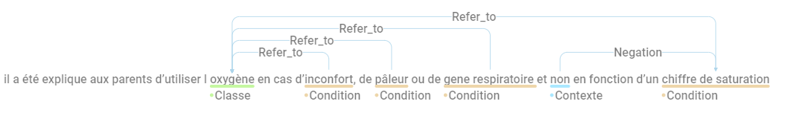

# Guide d'annotation

## Objectif

L'objectif est d'annoter chaque texte afin d'extraire un maximum d'informations
sur tous les traitements médicamenteux pris ou liés au patient.  Pour chaque
traitement un ensemble de *concepts* peuvent être annotés (ex : classe de
médicament, dose). Ces concepts peuvent être liés à une médicament à l'aide
de *relations*.

## L'annotation d'entités

Le premier objectif est l'annotation des entités, c'est à dire les instances de concepts. La tâche d'annotation est
centrée sur le médicament. L'ensemble des concepts suivant doivent être annotés
s'ils sont en relation avec un médicament ou une classe de médicaments, sauf pour les notions de temporalités qui sont toujours annotées même si elles ne sont pas liées avec un médicaments.

| Concept (cliquer pour le détail) | Classes | Lien avec un médicament |
| ------- | ------- | ------------|
| [Médicament ou Classe de médicaments](#médicament-ou-classe-de-médicaments) | `Med`, `Classe` | |
| [Dose](#dose-dose) | `Dosage` | en relation avec un médicament |
| [Fréquence](#fréquence-freq) | `Freq` | en relation avec un médicament |
| [Durée](#durée-duree)  | `Duree` | en relation avec un médicament |
| [Voie d'administration](#voie-dadministration-route) | `Route` | en relation avec un médicament |
| [Condition](#condition-condition) | `Condition` | en relation avec un médicament |
| [Date/Date relative](#date-date) | `Date`/`Date_relat` | en relation ou non avec un médicament |
| [Contexte]("#attributs-de-contexte") | `Contexte` | en relation avec un médicament |

## L'annotation des relations

Le deuxième objectif est l'annotation de relations entre les entités, notamment entre les médicaments et les concepts qui décrivent leurs propriétés. L'ensemble des relations suivantes nécessite d'être
annoté :

| Relation | Entités liées |
| -------- | ------------- |
| `Start` | entre une `Date` ou un `Contexte` et un `Med` ou `Classe` |
| `Stop` |  entre une `Date` ou un `Contexte` et `Med` ou `Classe` |
| `En_cours` |  entre une `Date` ou un `Contexte` et `Med` ou `Classe` |
| `Duree_presc` |  entre une `Duree` et `Med` ou `Classe` |
| `Duree_admin` |  entre une `Duree` et `Med` ou `Classe` |
| `Refer_to` |  entre une `Dosage`, une `Route`, une `Freq` ou une `Condition` et un `Med` ou `Classe` |
| `Augmentation`, `Diminution`  |  entre une `Contexte` et `Med` ou `Classe` |
| `Negation`, `Hypothétique`,`Contre_indique`,`Experiencer` |  entre un `Contexte` et `Med` ou `Classe`  |
| `Disc_ent`  |  Si une entité est discontinue, la relation  `Disc_ent` doit être utilisé entre les deux parties de l'entité. |
| `Coref`  |  Cette relation fait référence à une répétition d'un médicament dans un document. Toutes répétitions au sein d'un document doit être annotée, qu'elle soit dans la même phrase ou non. Si la classe d'un médicament est spécifiée, donc qu'il y a une entité `Med` et une entité `Classe"`, il faut utiliser la relation `coref`,  le sens de la relation doit aller de la classe au médicament. |

Le sens des relations `Disc_ent` et `Coref` n'ont pas d'importance, car les entités reliées appartiendront toujours à la même frame (en dehors de la relation liant une `Classe` et un `Med`).

<!--Pour les relations `Same_frame` il est nécessaire de relier l'ensemble des entités à une entité cible qui sera elle-même reliée à un autre type d'entité de la frame. Ceci permettant de différencier des attributs complexes de médicaments pouvant être composé d'éléments individuels différents pour différentes frames.--->

<!--Exemple : 

Ici deux frames sont créées pour le med1 et le med2. La fréquence de med1 est composée de plusieurs entités toutes reliées par la relation `Same_frame` à l'entité freq2 : freq1, freq2, freq3 et freq5.
Pour le med2, les entités reliées à freq3 sont prises en compte : freq1.--->

## Unité d'annotation 

L’annotation est centrée sur le concept de *frame* basé sur la temporalité d'administration des médicaments. 
Chaque médicament unique est défini par une date de début, date de fin différente. Cette notion de date de dispensation différente peut être explicite (date de fin et de début explicitement écrite) ou implicite (changement de dose, changement de fréquence...). Ces différentes dispensations seront centrales pour générer les frames 

Si un médicament est renseigné de manière simple dans le dossier patient, et qu'il respecte ce concept de frame, l'ensemble des attributs des médicaments doivent être reliés au médicament. Voir [exemple](#1--1) Il s'agira de l'entité centrale de la frame.

Si un médicament est renseigné avec plusieurs coréférences, choisir une des entités comme entité centrale, en priorité une entité `Med` par rapport aux entités `Classe`.

Si un médicament est indiqué avec plusieurs prescriptions différentes, il faut relier l'ensemble des attributs du médicament à une **entité unique** du médicament si celui-ci n'est pas répété (dans l'ordre de préférence : Médicament > Classe  > Dose > Fréquence > Durée d'administration > Voie d'administration > Condition de dispensation > Date de début > Date de fin > Contexte ). Le but étant de pouvoir créer sans hésitation les frames pour chacune des différentes prescriptions, même si des données sont manquantes. Voir exemple [Exemple](#2--1). Ces entités seront les entités centrales des différentes frames.

Dans le cas de médicaments avec des coreférences, ou avec mention de la classe du médicament, les attributs présents dans le texte doivent être reliés avec l'entité la plus proche sauf si les attributs ne peuvent pas être reliés au médicament, car plusieurs frames sont présentes, dans ce cas tout relier à l'entité centrale. [Exemple](#3--1)

| À annoter               | Class d'annotation | Relation avec le médicament | exemple                     |
|-----------------|-----------------|---------------------|-----------------|
| médicaments            | Med/Classe          |                              | arimidex/corticoïde         |
| Dose                   | Dosage               | Refer_to                     | 1 G de doliprane            |
| Fréquence              | Freq               | Refer_to                     | 3 cp/jour                   |
| Voie d'administration  | Route              | Refer_to                     | en intraveineuse            |
| Durée d'administration | Duree           | Duree_admin               | 1L de serum phy pendant 5h  |
| Durée de prescription  | Duree           | Duree_presc               | arimidex pendant 5 ans      |
| Condition de dispensation | Condition           | Refer_to               | doliprane en si besoin      |
| Date de début          | DATE               | Start                        | dès ce jour                 |
| Date de fin            | DATE               | Stop                         | arrêt le 4 juin             |
| Traitement en cours           | DATE               | En_cours                         |            |
| Date non spécifié      | DATE               | Refer_to                     | il y a environ 3-4 semaines |
| Élément contextuel    | Context               | Negation                  |  |
| Élément contextuel    | Context               | Hypothétique                  |  |
| Élément contextuel    | Context               | Experiencer                  |  |
| Élément contextuel    | Context               | Augmentation                  |  |
| Élément contextuel    | Context               | Diminution                  |  |
| Élément contextuel    | Context               | Start                  |  |
| Élément contextuel    | Context               | Stop                  |  |
|     Élément contextuel                  |Context                        |   En_cours                    | actuellement sous amoxicilline   |

Les annotations doivent être faites même s'il y a des fautes d'orthographe, sauf si ces fautes d'orthographe peuvent induire une
confusion.

### Médicament ou Classe de Médicaments

Tous les médicaments énumérés dans le résumé de décharge et donnés (présents, passés ou futurs) ou contre-indiqués à un expérimentateur.

#### Que faut-il annoter ?

Nom du médicament, générique, classe de médicaments ou de substances. Si un médicament est composé d'une association de plusieurs molécules (correspondant à une classe ATC), alors annoter comme une seule entité (ex: Doliprane Codéiné ; ATC: *"N02AJ06 : Codéine et paracétamol"* ). Ne pas annoter "traitement par", uniquement le nom du médicament.

La différence entre médicament et classe : une classe fait référence à une catégorie de médicaments (ex: Corticoïdes, Antibiotique...), un médicament fait référence à une molécule ou une combinaison de molécules spécifiques (Paractétamol, doliprane codéiné, une seule sous classe ATC)
Lien pour identifier si l'entité est un médicament ou une classe :

-[Observatoire du médicament](https://observatoiredumedicament.cyrilcoquilleau.com/)

- [SIFR BioPortal](https://bioportal.lirmm.fr/search?q=&ontologies=ATCFRE&include_properties=false&include_views=false&includeObsolete=false&require_definition=false&exact_match=false&categories=)

- [HeTOP](https://www.hetop.eu/hetop/fr/?q=&home), pas de classification ATC

#### Médicament (`Med`)

##### Inclus :

- Les substances sur ordonnance :
  - Les médicaments de marque, par exemple, *doliprane*.
  - Génériques, par ex., *paracétamol*.
  - Ingrédients, par exemple, *furosémide*.
  - Noms collectifs d'un groupe de médicaments, par exemple *corticoïdes* (il sera annoté comme une classe de médicaments).
- Médicaments en vente libre :
  - Noms de marque, par exemple, *Aspirine*.

- Substances biologiques requises ou suggérées par les médecins
  - Ingrédients de la nutrition parentérale totale s'ils sont énumérés individuellement
  - Composants des liquides IV et des solutions salines énumérés (y compris l'"eau minérale" et le "sérum physiologique")
  - Débit glucidique
- Thérapie par substance, par exemple, *Corticothérapie* ou *antirétroviral* (elle sera annotée comme une classe de médicaments).
 

##### Exclus :

- Nourriture et eau non utilisées comme traitement
- Régime alimentaire
- Tabac
- Alcool
- Médicaments illicites
- transfusion

#### Classe de médicaments (`Classe`)

##### Inclus :

- Nom collectif d'un groupe de médicaments, par exemple *corticoïdes*, *vitamines*.
- Thérapie par substance, par exemple, *Corticothérapie* ou *traitement antirétroviral*.
- "therapie"
  - oxygénothérapie
  - corticothérapie
  - antibiothérapie
  - antibiotique
- "traitement anti-" avec ou sans "traitement" avant (annoter le plus cours possible donc sans le "traitement")
  - traitement antalgique
  - traitement antirétroviral
  - antihypertenseur
  - vaccination antigrippale
  - antifongique
- Protocole de chimiothérapie
  - abvd
- Autres
  - vaccination contre l'hépatite b/méningocoque...
  - nutrition (si utilisée comme traitement)
    - "oral/parentérale/entérale"
      - inclure le nom du médicament
      - sauf s'il y a une distinction entre les deux "nutrition orale, mais pas entérale".
    - régime d'urgence
  - complément nutritionnel
- Acronyme
  - np (pour nutrition parentérale)
  - avk (pour anti-vitamine K)
  - o2
  - vit-d

##### Exclus :

- "traitement" sans précision
  - traitement prophylactique
  - traitement pour son asthme
- Action suivie par "par"
  - sedation
  - (re)hydratation
  - antibioprophylaxie
- Dispositif médical, sauf s'il contient un médicament (e.g. on annote Pompe à Insuline)

#### Comment annoter ?

Annotez la phrase nominale complète qui correspond au nom du médicament, par exemple, amoxicilline acide clavulanique. L'annotation doit être faite même s'il y a des fautes d'orthographe. Ne pas inclure des mots tels que "injectable", "crème", "nébuliseur", "solution" comme faisant partie du nom du médicament même s'ils apparaissent immédiatement après le nom du médicament, par exemple, sélénium injectable, xylocaïne nébuliseur. N'incluez pas d'information numérique dans le nom du médicament, p. ex. renutril 500, à moins qu'il ne s'agisse d'un type de substances, par ex. iodure 131. Sans le cas du renutril 500, *500* correspond à la dose.

Les pronoms qui font référence à un médicament doivent être annotés et une relation de `Coref` doit être ajoutée.

#### Exemples :

- *amlor : 10 mg le matin*
  - `Med` : *amlor*
- *ialuset plus creme*
  - `Med` : *ialuset plus*
  - (*creme* non inclus dans `Med`)
- *sevrage de l oxygenotherapie en fevrier 2013*
  - `Classe` : *oxygenotherapie*
- *grand-mere maternelle : diabete de type 2 a 61 ans, sans surpoids, traitee par insuline*
  - `Med` : *insuline*
  - `context` : *grand-mere maternelle*
  - relation : *grand-mere maternelle* <--> *insuline* : `Experiencer`

Chaque référence conjointe d'un médicament (nom de classe ou de médicament) ou de ses génériques, y compris avec des fautes d'orthographe, dans le même paragraphe, doit être annotée si elles appartiennent à la même frame (même médicament, même temporalité). Une relation de `Coref` entre les entités doit être rajoutée.

- *doliprane 1 dose poids\*4/ jour si douleurs (paracetamol 1 boite)*
  - `Med` : *doliprane*
  - `Med` : *paracetamol*
  - relation : *doliprane* <--> *paracetamol* : `Coref`
- *(matin : 9-12 ui novorapid(1), 20 ui levemir(1), dans les 4 zones.*
*(gouter : 5-7 ui novorapid(2).*
*(soir : 6-8 ui novorapid(3), 15 ui levemir(2), dans les 4 zones.*
  - `Med` : *novorapid(1)*
  - `Med` : *levemir(1)*
  - `Med` : *novorapid(2)*
  - `Med` : *novorapid(3)*
  - `Med` : *levemir(2)*
  - relations : 
    - *novorapid(1)* <--> *novorapid(2)* : `Coref`
    - *novorapid(2)* <--> *novorapid(3)* : `Coref`
    - *levemir(1)* <--> *levemir(2)* : `Coref`
    
Si un traitement est écrit comme médicament et comme classe dans la même phrase, annoter les deux (comme médicament et comme classe). L'association d'un médicament à une classe dans la même phrase entraîne une annotation d'une relation de type "Refer_to" par médicament :

- *relais par avk au cours de l'hospitalisation (coumadine)*
  - `Med` : *coumadine*
  - `Classe` : *avk*
  - relation :  *avk* <-- *coumadine* : `Refer_to`
- *un traitement antiretroviral a ete debute (truvada, reyataz et norvir avec une charge virale…)*
  - `Classe` : *traitement antiretroviral*
  - `Med` : *truvada*
  - `Med` : *reyataz*
  - `Med` : *norvir*
  - relations : 
    - *traitement antiretroviral* <-- *truvada* : `Refer_to`
    - *traitement antiretroviral* <-- *reyataz* : `Refer_to`
    - *traitement antiretroviral* <-- *norvir* : `Refer_to`
    

L'énumération des médicaments partageant un mot doit être annotée comme plusieurs entités disjointes en utilisant la relation `Disc_ent` :

- *vitamine C , D , A , and E*
  - `Med` : *vitamine C*
  - `Med` : *vitamine*
  - `Med` : *D*
  - `Med` : *A*
  - `Med` : *E*
  - relations : 
    - *vitamine* --> *D* : `Disc_ent`
    - *vitamine* --> *A* : `Disc_ent`
    - *vitamine* --> *E* : `Disc_ent`
  

- *une dose de vitamine C et vitamine D*
  - `Med` : *vitamine C*
  - `Med` : *vitamine D*

Annoter le nom des médicaments même si leurs attributs ou eux même sont niés

- *pas de necessite de doublement des doses d hydrocortisone*
  - `Med` : *hydrocortisone*

Dans le cas d'un dispositif médical, on annote uniquement le médicament (s'il s'y trouve). Le dispositif sera annoté comme une [voie d'administration](#voie-dadministration-route (`Route`).

- *Pompe à Insuline*
  - `Med` : *Insuline*

- *DIU MIRENA*
  - `Med` : *MIRENA*

-------------------------------------------------------
### Dose (`Dosage`)

La quantité d'un seul médicament utilisé dans chaque administration, par exemple *un comprimé, une dose, 30 mg*.

#### Que faut-il annoter ?

Les informations numériques et/ou textuelles qui indiquent la quantité et l'unité d'administration d'un médicament utilisées pour une seule administration, uniquement si elles sont en rapport avec un médicament. Annoter le dosage numérique et l'unité dans la même annotation.

##### Inclus (liste non exhaustive) :

- 1 cp
- un comprimé
- 0.4 mg
- 0.5 m.g.
- 100 mg/kg
- une dose kilo
- 100 mg x 2 comprimés
- 500 mg : 2 gelules
- 4000 ui / 0,4
- 1 sachet
- 2 cuillère-mesure
- deux bouffées
- 3 bolus
- double dose
- [renutril] 500

##### Exclus :

- si la dose est niée et que le médicament est donné, par exemple :
  - n'annotez pas "doublement des doses" pour "pas de necessite de doublement des doses d hydrocortisone". 

- Doses cumulées (car trop de variabilité dans la signification) :
  - 3 boîtes
  - dans *doliprane 1 dose poids\*4/ jour si douleurs (paracetamol 1 boite)*
    - `Dosage` : *1 dose poids*
    - annoter *1 boite* mais ne pas mettre de relation, car unité de délivrance

#### Commnent annoter ?

Annotez tous les doses mentionnées de tous les médicaments présents et leur relation avec celui-ci, même s'il fait partie du nom du médicament.

#### Relations avec le médicament

Utiliser la relation `Refer_to` pour relier une dose à un médicament.

#### Exemples : 

- *speciafoldine 5mg 10 jours par mois*
  - `Med` : *speciafoldine*
  - `Dosage` : *5mg*
  - relation : *5mg* --> *speciafoldine* : `Refer_to`
- *oracilline 500mui x 2 par jour.*
   - `Med` : *oracilline*
  - `Dosage` : *500mui*
  - relation : *500mui* --> *oracilline* : `Refer_to`
- *depakine 500 x 3 par jour*
  - `Med` : *depakine*
  - `Dosage` : *500*
  - relation : *500* --> *depakine* : `Refer_to`
- *vitabact 0,05 % : x4/jour dans chaque oeil pendant 10 jours*
  - `Med` : *vitabact*
  - `Dosage`: *0,05 %*
  - relation : *0,05 %* --> *vitabact* : `Refer_to`

si la dose est séparée en plusieurs parties, relier l'ensemble des parties à l'entité centrale de la frame (unité de dispensation).

Si les doses correspondent à une conversion d'unité, utiliser la relation `coref`

- *hydrea 500mg un jour sur 2, 1000mg un jour sur 2*.
  - `Dosage` : *500mg*
  - `Dosage` : *1000mg*
  - relation : 
      - *500mg* --> *hydrea* : `Refer_to`
      - *1000mg* --> *hydrea* : `Refer_to`
- *hydrocortisone : 7,5 mg le matin, 5 mg le soir (12,5 mg/m²/jour )*
  - `Dosage` : *7,5 mg*
  - `Dosage` : *5 mg*
  - `Dosage` : *12,5mg/m²*
   - relation : 
      - *7,5 mg* --> *hydrocortisone* : `Refer_to`
      - *5 mg*--> *hydrocortisone* : `Refer_to`
      - *5 mg* <--> *12,5mg/m²* : `Coref`
      - *7,5 mg* <--> *12,5mg/m²* : `Coref` (La dose composée de 5mg et 7.5m réfère au 12.5mg/m²)

Annotez les différentes façons de se référer aux mêmes doses dans des entrées séparées, et les rassembler avec une relation de `Coref`:

- *sandostatine : 100µg/8h en sc soit 50µg/kg/j*
  - `Dosage` : *100µg*
  - `Dosage` : *50µg/kg*
   - relation : 
      - *100µg* <--> *50µg/kg* : `Coref`

- *seretide 50 deux bouffeesx2/j*
  - `Dosage` : *50*
  - `Freq` : *deux bouffeesx2/j*
- *singulair 1 sachet de 4mg/jour,*
  - `Dosage` : *1 sachet de 4mg*

Annoter un seul motif pour tous les médicaments lorsque la dose en concerne plusieurs et les relier par une entité `Refer_to`

- *doliprane et ibuprofene, 1 comprime toutes les 6 heures chacun*
  - `Dosage` : *1 comprime*
  - `Med` : *doliprane*
  - `Med` : *ibuprofene*
  - relation : 
    - *1 comprime* --> *doliprane* : `Refer_to`
    - *1 comprime* --> *ibuprofene* : `Refer_to`

### Fréquence (`Freq`)

Termes, phrases ou abréviations qui décrivent la fréquence à laquelle chaque dose du médicament doit être prise. 

#### Que faut-il annoter ?

Toute expression qui indique la fréquence d'administration d'une dose unique d'un médicament doit être annotée.

##### Inclut :

- Les fréquences :
  - par jour
  - toutes les 8 heures
  - toutes les semaines
  - /jour
  - /j
  - /24 heures
  - par mois
  - tous les soirs
  - x 3 par jour
  - jour (si précéder d'un dose)
  - 1 - 1 - 1
  - 850 - 1000 - 1000 (Annoter en tant que dose et fréquence, voir [exemple](#13))
  - 19/03, 25/03 et 01/04/2016
  - a J3, J5 et J7
  - le matin

- Les phrases temporelles qui précisent quand un médicament doit être pris (il s'agit généralement de phrases prépositionnelles et la préposition doit être incluse dans l'information extraite) :

  - quotidiennement
  - quotidien
  - mensuel
  - après/avant manger
  - a 4 heures
  - avant chaque repas

#### Comment annoter ?

Appliquez les mêmes principes de base que pour le balisage de la dose. Annotez chaque fréquence, même si elle est répétée dans la même phrase.

#### Relations avec le médicament

Comme pour la dose, utiliser la relation `Refer_to` si la fréquence est en rapport avec un médicament.

#### Exemples : 

- *doliprane 1 dose poids\*4/ jour si douleurs*
  - freq : *\*4/ jour*
- *sectral : 48 mg matin et soir*
  - freq : *matin et soir*

Annoter la partie immédiatement adjacente d'une fréquence comme une seule entrée :
- *singulair a chaque bolus : 15g a 7h et 16h30*
  - freq : *a 7h et 16h30*

Si la fréquence est segmentée et concerne la même frame, annoter toutes les parties et les relier à l'entité la plus proche si l'entité centrale est un médicament, sinon relié l'ensemble des parties à l'entité centrale.

- *speciafoldine : 1 comprime par jour, 10 jours par mois. *
  - `dose` : *1 comprime*
  - `freq` : *10 jours par mois*
  - `freq` : *par jour*
  - relation : 
    - *10 jours par mois* --> *speciafoldine* : `Refer_to`
    - *par jour* --> *speciafoldine* : `Refer_to`
    - *1 comprime* --> *speciafoldine* : `Refer_to`

### Durée (`duree`)

Une expression de temps écoulé qui indique pendant combien de temps le
médicament doit être administré. Ces expressions sont souvent des syntagmes
nominaux, des syntagmes prépositionnels ou des clauses. Cette expression doit
être compatible avec un durée en relation avec un médicament. Ne pas annoter
l'âge. Annoter uniquement les durées en relation avec un médicament. Si une
durée est utilisée pour exprimer une date relative (ex: dans 3 mois), annoter
comme une date relative.

#### Qu'est-ce qui doit être annoté ?

Expressions qui décrivent la durée totale pendant laquelle le médicament doit être pris à une dose donnée. 

##### Inclus :

- Des expressions de durée (sans les adverbes) :

  - 10 jours
  - un mois
  - 2 semaines
  - tant que nécessaire
  - 3h

##### Exclus :

- Les expressions temporelles qui indiquent quand chaque dose doit être prise. Elles peuvent correspondre à une condition.

  - *a prendre pendant une activité physique*
    - pendant une *activité physique* n'est pas une durée mais une condition, le pendant peut être remplacer par "en cas". 

- Expression temporelle du début ou de l'arrêt d'un médicament (date relative) :

  - dans 10 jours
  - depuis 10 jours

- l'âge des patients

#### Comment annoter ?

Suivez les mêmes principes de base que pour l'annotation de la fréquence. N'incluez pas les prépositions complètes.

**Ne pas inclure les "pendant" ou les "durant", etc. dans l'annotation, mais seulement la durée elle-même.**

#### Relations avec le médicament

Deux relations sont possibles : 
- `Duree_admin` : pour la durée d'administration d'une dose de médicament (ex : administration IV)
- `Duree_presc` : pour la durée de prescription 

#### Exemples

- *vitabact 0,05 % : x4/jour dans chaque oeil pendant 10 jours*
  - `duree` : *10 jours*
  - `Med` : *vitabact*
  - relation : *10 jours* --> *vitabact* : `Duree_presc`
- *ciflox 500 mg par 24 heures pour une duree totale de 3 semaines*
  - `duree` : *3 semaines*
  - `Med` : *ciflox*
  - relation : *3 semaines* --> *ciflox* : `Duree_presc`
-  *a donc beneficie de sa 2ieme perfusion de remicade (200mg) sur 3h*
  - `duree` : *3h*
  - `Med` : *remicade*
  - relation : *3h* --> *remicade* : `Duree_admin`
- *a ete traite pendant 2 ans par remicade*
  - `duree` : *2 ans*
  - `Med` : *remicade*
  - relation : *2 ans* --> *remicade* : `Duree_presc`

### Voie d'administration (`Route`)

Décrit la méthode d'administration du médicament. Eventuellement le dispositif médical qui permet l'administration et permet de connaître la route.

#### Qu'est-ce qui doit être annoté ?

Le texte qui exprime le mode/voie d'administration, même s'il est exprimé dans le cadre du nom du médicament ou de la posologie.

##### Inclus :

- per os
- intraveineux ou iv
- topique
- sublingual
- cutanée
- sous-cutanée
- intramusculaire
- perfusion
- creme
- solution buvable
- ophtalmique
- abréviations de ce qui précède

#### Comment annoter ?

Suivez les mêmes principes de base que pour l'annotation de la durée. Plusieurs routes peuvent être liées à un seul nom de médicament.

- *spray de ventoline : 2 bouffees x4 par jour pendant 4 jours au babyhaler.*
  - `Route` : *spray*
  - `Route` : *babyhaler*
- *hyperhydratation par voie intraveineuse*
  - `Route` : *intraveineuse*
- *necessitant un traitement par kayexalate et aerosol de ventoline*
  - `Route` : *aerosol*
- *Pompe à Insuline*
  - `Route` : *Pompe*
- *DIU MIRENA*
  - `Route` : *DIU*

Les changements dans le mode d'administration d'un médicament doivent être inclus dans des entrées séparées, dans des frames séparées.

- *traitement pendant 5 jours par clamoxyl iv puis relais per os*
  - `Route` : *iv*
  - `Route` : *per os*

Les différentes façons de désigner le même mode d'administration doivent être incluses dans des entrées séparées et reliées par la relation `coref`.

- *nebulisation de ventoline toutes les 6 heures puis relais par chambre d inhalation (baby-haler) le 06/02/2012*
  - `Route` : *nebulisation*
  - `Route` : *chambre d inhalation*
  - `Route` : *baby-haler*
  - relations : 
    - *chambre d inhalation* <--> *baby-haler* : `coref`

### Condition (`Condition`) 

Expressions qui indiquent la condition pour laquelle le médicament doit être
administré. Ces expressions sont souvent des propositions conditionnelles et
commencent par une expression conditionnelle telle que "si", "en cas de", "en
fonction de"...

#### Qu'est-ce qui doit être annoté ?

Condition pour laquelle le médicament doit être administré.

##### Inclus (liste non exhaustive) :

- [en cas de] fièvre
- [si] besoin
- [si] veut
- [en fonction] des ASAT

#### Comment annoter ?

Annotez toujours la phrase adjectivale de base la plus informative ou la phrase
nominale de base la plus courte comme condition du médicament. N'incluez pas
les phrases complexes, n'incluez pas les phrases coordonnées. Au lieu de cela,
extrayez de ces phrases la phrase de base, même si cela signifie que vous vous
retrouverez avec plusieurs conditions.

**Ne pas inclure les "si" ou les "en cas de", etc. dans l'annotation.**

#### Exemples

- *codenfan une dose/poids si besoin maximum 3x par jour*
  - `Condition` : *besoin*

S'il y a différentes conditions mentionnées pour le même médicament, alors inclure une entrée par condition et les relier au médicament. Dans les cas où plusieurs médicaments sont donnés avec la même condition, indiquez la condition et la relier la avec tous les médicaments.

- *il a ete explique aux parents d utiliser l oxygene en cas d inconfort, de paleur ou de gene respiratoire et non en fonction d un chiffre de saturation*
  - `Condition` : *inconfort*
  - `Condition` : *paleur* 
  - `Condition` : *gene respiratoire*
  - `Condition` : *un chiffre de saturation* 
  - `contexte` : *non*
  - relations : 
    - *inconfort* --> *oxygene* : `Refer_to`
    - *paleur* --> *oxygene* : `Refer_to`
    - *gene respiratoire* --> *oxygene* : `Refer_to`
    - *chiffre de saturation* --> *oxygene* : `Refer_to` 
    - *non* --> *un chiffre de saturation* : `Negation` 
  
Si une condition est composée de plusieurs sous-conditions (séparées par "et"), annoter séparément avec plusieurs entrées.

- *melatonine 2mg : 1 gelule au coucher si agitation et probleme d endormissement*
  - `Condition` : *agitation*
  - `Condition` : *probleme d endormissement* 

Les différentes façons de désigner la même condition pour les médicaments doivent être traitées comme des conditions distinctes, rajouter une relation `coref`.

- *en cas d'anemie aregenerative (hemolyse non mecanique) augmenter les corticoides*
  - `Condition` : *en cas d'anemie aregenerative* 
  - `Condition` : *hemolyse non mecanique*
  - relations : 
    - *en cas d'anemie aregenerative* <-->  *hemolyse non mecanique* : `coref`
    

### Date (`Date`)

Annoter toutes les mentions de marqueurs temporels présents dans les
documents, ajouter des relations si elles sont reliées à des médicaments.
Annoter les dates relatives (dans 10 jours, il y a 6 mois ) comme des
`Date_relative`.

Cette information est généralement exprimée par une date ou une heure. Annoter
la date (respectivement l'heure) ou la composition des deux la plus précise possible, sans prendre en compte les
prépositions. Si une date est composée d'un jour et d'une horaire, annoter l'ensemble comme une seule entité (ex : `01/20/2022 02:00`)

#### Qu'est-ce qui doit être annoté ?

En priorité il est nécessaire d'annoter la date la plus précise possible.

#### Comment annoter les relations avec les médicaments

Choisissez parmi les valeurs possibles :

- `Start` : date indiquant le début de la prise du médicament ou la date du début.
- `Stop` : date indiquant l'arrêt de la prise du médicament .
- `Refer_to` : date indiquant une notion de temporalité du médicament, sans spécifier la date de début ou de fin (ex : prise de 1 cp de doliprane le 21/01/2023)
- `en_cours` : date indiquant la poursuite de la prise du médicament

#### Exemples :

- *le 01/20/2022 02:00*
  - `Date` : *01/20/2022 02:00*
- *meningocoque a + c : 11/07.*
  - `Date` : *11/07*
  - `Med` : *meningocoque a + c*
  - relations : 
    - *11/07* --> *meningocoque a + c* : `Refer_to`
- *antibiotherapie debutee lors de la chirurgie, a arrete a j5*
  - `Classe` : *antibiotherapie*
  - `Date_relative` : *j5*
  - relations : 
    - *j5* --> *antibiotherapie* : `Stop`
- *doliprane du 11 mai au 25 mai*
  - `Med` : *doliprane*
  - `Date` : *11 mai*
  - `Date` : *25 mai*
  - relations : 
    - *11 mai* --> *doliprane* : `Start`
    - *25 mai* --> *doliprane* : `Stop`
- *arret du nubain le 14/12/2010*
  - `Med` : *nubain*
  - `Date` : *14/12/2010*
  - relations : 
    - *14/12/2010* --> *nubain* : `Stop`
- *janvier 2006 : nouveau syndrome thoracique aigu, mise sous hydrea.*
  - `Med` : *hydrea*
  - `Date` : *janvier 2006*
  - relations : 
    - *janvier 2006* --> *hydrea* : `Start`
- *compte-rendu d hospitalisation de jour du 27/12/2012 pour sa 16ieme perfusion de remicade*
  - `Med` : *remicade*
  - `Date` : *27/12/2012*
  - relations : 
    - *27/12/2012* --> *remicade* : `Refer_to`

Le passage d'un médicament à un autre comprend deux événements sur la même expression. Un médicament est arrêté et un autre est commencé.

- *la pancytopenie s est compliquee apres la chimiotherapie d un sepsis a escherichia coli resistant a la tazocilline (tazocilline\* depuis le 6 septembre 2010) traite par fortum a partir du 15 septembre 2010*
  - `Classe` : *chimiotherapie*
  - `Med` : *tazocilline*
  - `Med` : *tazocilline*
  - `Med` : *fortum*
  - `Date` : *6 septembre 2010*
  - `Date` : *15 septembre 2010*
  - relations : 
    - *tazocilline* <-->  *tazocilline* : `Coref` 
    - *6 septembre 2010* --> *tazocilline* : `Start`
    - *15 septembre 2010* --> *tazocilline* : `Stop`
    - *15 septembre 2010* --> *fortum* : `Start`

S'il y a plusieurs prescriptions (en terme de temporalité) pour un même évenement, annoter l'ensemble des entités et créer des relations permettant de recréer une frame pour chaque prescription. Relier tout les attributs à l'entité la plus discriminante entre les prescriptions ((dans l'ordre de préférence : date, dose, fréquence, voie d'administration ) . 

- *debut du traitement par ambisome le 29 mars 2014 a 3 mg/kg jusqu au 2 avril puis 5 mg/kg jusqu au 7 avril, puis 7,5 mg/kg jusqu au 30 avril*
  - `med` : *ambisome*
  - `Date` : *29 mars 2014*
  - `Date` : *2 avril*
  - `Date` : *7 avril*
  - `Date` : *30 avril*
  - relations : 
    - *ambisome* --> *29 mars 2014* : `start`
    - *ambisome* --> *2 avril* : `start`
    - *ambisome* --> *7 avril* : `start`
    - *2 avril* --> *29 mars 2014* : `end`
    - *7 avril* --> *2 avril* : `end`
    - *30 avril* --> *7 avril* : `end`
  

### Attributs de contexte

#### Que faut-il annoter ?

Il faut annoter les cas où le contexte d'une entité est modifié (négation,
hypothétique, contre-indication, lié à une autre personne, diminution de la
dose, augmentation de la dose) ou dans le cas d'un début ou arrêt d'un
médicament. Les relations avec les entités caractériserent les éléments de
contexte. Annoter la plus petite expression possible prenant en compte le
contexte.

1. Annoter les entités modifiant le contexte de la phrase (ex: *pas* de prise
   de doliprane, *relais* par héparine).
2. Puis reliez ces éléments aux médicaments avec une des relations possibles :
   `Negation`, `Hypothétique`,`Contre_indique`,`Experiencer`,
`Diminution` , `Augmentation`, `Start`, `Stop`.

L'annotation des entités modifiant le contexte doit être fait dans tous les cas, même si une entité plus précise existe.
Par exemple dans la phrase, *le doliprane a été arrêté le 10/01/2015", il faut annoter à la fois le contexte *arrêté* et la date d'arrêt *10/01/2015* et relier les deux au médicament avec une relation de type `Stop`

#### Types de relations :

- Pour les médicaments suggérés ou incertains, un attribut de contexte `Hypothétique` doit être ajouté. 

- Pour les médicaments non pris ou non donnés, un attribut de contexte `Negation` doit être ajouté (la relation sur un médicament négativé peut être annotée, par exemple, la relation entre avk et durée doit être annotée pour "pas d'avk pendant 2 jours"). 

- Pour les médicaments mentionnés comme contre-indication, le contexte `Contre_indique` doit être annotée.

- Expérimentateur (`Experiencer`) : Si le traitement concerne d'autres personnes, elle doit être annotée avec un attribut d'expérimentateur 
- Diminution augmentation (`Diminution`/`augmentation`) pour les médicaments ayant une notion de diminution augmentation sans temporalité clairement définie .

#### Exemples 

- *antibiotherapie debutee lors de la chirurgie, a arrete a j5*
  - `Classe` : *antibiotherapie*
  - `Context` : *lors de la chirurgie*
  - relations : 
    - *lors de la chirurgie* --> *antibiotherapie* : `Start`
- *Aspirine 500mg /jour, pas de precription de dolipran*
  - `Med` : *Aspirine*
  - `Med` : *dolipran*
  - `Contexte` : *pas de prescription*
  - relations : 
    *pas de prescription* --> *dolipran* : `Negation` 
- *Relais de l'augmentin par de l'ammoxicilline*
  - `Med` : *augmentin*
  - `Med` : *ammoxicilline*
  - `Contexte` : *Relais*
  - relations : 
    - *Relais* --> *augmentin* : `Stop`
    - *Relais* --> *ammoxicilline* : `Start` 

## Exemples Globaux:

### 1 : 

- *La pancytopenie s'est compliquée après la chimiothérapie d’un sepsis a Escherichia coli résistant a la tazocilline (tazocilline\* depuis le 6 septembre 2010) traite par fortum à partir du 15 septembre 2010*
  - `Classe` : *chimiotherapie*
  - `Med` : *tazocilline*
  - `Med` : *tazocilline*
  - `Date` : *6 septembre 2010*
  - `Med` : *fortum*
  - `Med` : *15 septembre 2010*
  - relations :
    - *tazocilline* --> *tazocilline* : `Coref`
    - *6 septembre 2010* --> *tazocilline* : `Start`
    - *15 septembre 2010* --> *tazocilline* : `Stop`
    - *15 septembre 2010* --> *fortum* : `Start`

  

### 2 : 

- *AUGMENTIN 600mg toutes les 8h jusuq'au 2019-10-11 inclus. PARACÉTAMOL(1;2) 250mg(1;2) toutes les 6h de façon systématique pendant 48h puis en cas de douleurs pendant 7 jours*
 - `Med` : *AUGMENTIN*
 - `Dosage` : *600mg*
 - `Freq` : *toutes les 8h*
 - `Date` : *2019-10-11*
 - `Med` : *PARACETAMOL*(1;2)
 - `Dosage` : *250mg*(1;2)
 - `Freq` : *toutes les 6h*
 - `duree` : *48h*
 - `Condition` : *de façon systématique*
 - `Contexte` : *puis*

 - `duree` : *7 jours*
 - `Condition` : *en cas de douleurs*
  - relations :
    - *600mg* --> *AUGMENTIN* : `Refer_to`
    - *toutes les 8h* --> *AUGMENTIN* : `Refer_to`
    - *2019-10-11* --> *AUGMENTIN* : `Stop`
    
    - *250mg*(1;2) --> *de façon systématique* : `Refer_to`
    - *toutes les 6h* --> *de façon systématique* : `Refer_to`
    - *PARACETAMOL*(1;2)  --> *de façon systématique*: `Refer_to`
    - *48h* --> *de façon systématique* : `Duree_presc`
    - *puis* --> *de façon systématique* : `Stop`
    
    - *250mg*(1;2) -->  *en cas de douleurs* : `Refer_to`
    - *PARACETAMOL*(1;2)  --> *en cas de douleurs*: `Refer_to`
    - *7 jours* --> *en cas de douleurs* : `Duree_presc`
    - *puis* --> *en cas de douleurs* : `Start`

### 3.1 :

- Différence d'attribution des relations, cas simple, cas multi-frame

### 3.2 : 

- *il a été explique aux parents d’utiliser l oxygène en cas d’inconfort, de pâleur ou de gene respiratoire et non en fonction d’un chiffre de saturation*
 - `Classe` : *oxygène*
 - `Condition` : *en cas d’inconfort*
 - `Condition` : *de pâleur*
 - `Condition` : *gene respiratoire*
 - `Contexte` : *non*
 - `Condition` : *en fonction d’un chiffre de saturation*
 - relations :
  - *en fonction d’un chiffre de saturation* --> *oxygène* : `Refer_to`
  - *gene respiratoire* --> *oxygène* : `Refer_to`
  - *de pâleur* --> *oxygène* : `Refer_to`
  - *en cas d’inconfort* --> *oxygène* : `Refer_to`
  -  *non* --> *en fonction d’un chiffre de saturation* : `Negation`

### 4 : 

- *doliprane 1 dose poids\*4/ jour si douleurs (paracetamol 1 boite)*
  - `Med` : *doliprane*
  - `Med` : *paracetamol*
  - `Dosage` : *1 dose poids*
  - `Freq` : *4/jour*
  - `Condition` : *si douleurs*
  - `Dosage` : *1 boite*
  - relations :
    - *paracetamol* --> *doliprane* : `Coref`
    - *1 dose poids* --> *doliprane* : `Refer_to`
    - *4/jour* --> *doliprane* : `Refer_to`
    - *si douleurs* --> *doliprane* : `Refer_to`

Ici le *1 boite* ne correspond pas à une dose de médicaments, mais une dose de dispensation en pharmacie, ne pas le relié au médicament

### 5 

  - *A l'arrêt du traitement par Lansoprazole 15 mg/jour, le patient présente une récidive des épigastralgies. Je lui renouvelle son traitement à la demande.*
    - `Contexte` : *A l'arrêt*
    - `Med` : *Lansoprazole*
    - `Dosage` : *15 mg*
    - `Freq` : */jour*

    - relations :
      - *A l'arrêt* --> *Lansoprazole* : `Stop`
      - *15 mg* --> *Lansoprazole* : `Refer_to`
      - */jour* --> *Lansoprazole* : `Refer_to`

Ici pas assez de contexte pour savoir si le traitement renouvelé est le lansoprazole.

      

### 6 
  - *SOLUPRED 7,5 mg/jour pendant 4 semaines (du 30/11/2020 au 27/12/2020 inclus) Puis 5 mg/jour pendant 4 semaines (du 28/12/2020 au 24/01/2021 inclus) Puis diminuer d?1 mg toutes les 4 semaines jusqu'?à l?arrêt complet du traitement.*
    - `Med` : *SOLUPRED*
    - `Dosage` : *7,5 mg*
    - `Freq` : */jour*
    - `Duree` : *4 semaines*
    - `Date` : *30/11/2020*
    - `Date` : *27/12/2020*
    - `Dosage` : *5 mg*
    - `Freq` : */jour*
    - `Duree` : *4 semaines*
    - `Date` : *28/12/2020*
    - `Date` : *24/01/2021*
    - `Contexte` : *diminuer*
    - `Dosage` : *1 mg*
    - `Freq` : *toutes les 4 semaines*
    - `Contexte` : *jusqu'?à l?arrêt complet du traitement*
    - relations :
      - *SOLUPRED* --> *7,5 mg* : `Refer_to`
      - *30/11/2020* --> *7,5 mg* : `Start`
      - */jour* --> *7,5 mg* : `Refer_to`
      - *4 semaines* --> *7,5 mg* : `Duree_presc`
      - *27/12/2020* --> *7,5 mg* : `Stop`
      
      - *SOLUPRED* --> *5 mg* : `Refer_to`
      - *28/12/2020* --> *5 mg* : `Start`
      - */jour* --> *5 mg* : `Refer_to`
      - *4 semaines* --> *5 mg* : `Duree_presc`
      - *24/01/2021* --> *5 mg* : `Stop`
      
      - *jusqu'?à l?arrêt complet du traitement* --> *24/01/2021* : `Stop`
      - *1 mg* --> *24/01/2021* : `Refer_to`
      - *diminuer* --> *1 mg* : `Diminution`
      - *toutes les 4 semaines* --> *diminuer* : `Refer_to`

    
  
  

### 7 : 

- *je ne modifie pas son traitement, soit toujours lasilix 20 mg/j, atacand 8 mg, ezetrol , calciparat 1 g, allopurinol 300 mg et crestor 5.*
  - `Contexte` : *toujours*
  - `Med` : *lasilix*
  - `Dosage` :  *20 mg*
  - `Freq` : */j*
  - `Med` : *atacand*
  - `Dosage` :  *8 mg*
  - `Med` : *ezetrol*
  - `Med` : *calciparat*
  - `Dosage` :  *1 g*
  - `Med` : *allopurinol*
  - `Dosage` :  *300 mg*
  - `Med` : *crestor*
  - `Dosage` : *5*
  - relations :
    -  *toujours* --> *lasilix* : `en_cours`
    -  *toujours* --> *atacand* : `en_cours`
    -  *toujours* --> *ezetrol* : `en_cours`
    -  *toujours* --> *calciparat* : `en_cours`
    -  *toujours* --> *allopurinol* : `en_cours`
    -  *toujours* --> *crestor* : `en_cours`
    - *20 mg* --> *lasilix* : `Refer_to`
    - */j* --> *lasilix* : `Refer_to`
    - *8 mg* --> *atacand* : `Refer_to`
    - *1 g* --> *calciparat* : `Refer_to`
    - *300 mg* --> *allopurinol* : `Refer_to`
    - *5* --> *crestor* : `Refer_to`
  

### 8 :

- *Pluyqieurs bilans biologiques ont été réalisés notant un syndrome inflammatoire oscillant entre 11 et 45mg/l mi-juillet*

 - `mi-juillet` : *date*

### 10 : 

- *traitement pendant 5 jours par clamoxyl iv puis relais per os* 
    - `Duree` : *5 jours*
    - `Med` : *clamoxyl*
    - `Route` : *iv*
    - `Contexte` : *puis*
    - `Route` : *per os*

    - relations :
      - *5 jours* --> *iv* : `Duree_presc`
      - *clamoxyl* --> *iv* : `Refer_to`
      - *puis* --> *iv* : `Stop`

      - *clamoxyl* --> *per os* : `Stop`
      - *puis* --> *per os* : `Start`
      

### 11

  - *nebulisation de ventoline toutes les 6 heures puis relais par chambre d inhalation (baby-haler) le 06/02/2012*
    - `Route` : *nebulisation*
    - `Med` : *ventoline*
    - `Freq` : *toutes les 6 heures*
    - `Route` : *chambre d inhalation*
    - `Route` : *baby-haler*
    - `Date` : *06/02/2012*
    - `Contexte` : *puis*

    - relations :
      - *ventoline* --> *nebulisation* : `Refer_to`
      - *toutes les 6 heures* --> *nebulisation* : `Refer_to`
      - *06/02/2012* --> *nebulisation* : `Stop`
      - *puis* --> *nebulisation* : `Stop`

      - *baby-haler* --> *chambre d inhalation* : `Coref`
      - *06/02/2012* --> *chambre d inhalation* : `Start`
      - *puis* --> *chambre d inhalation* : `Start`
      - *ventoline* --> *chambre d inhalation* : `Refer_to`

      
      

### 12

Les (1),(2),(3) sont uniquement présents pour différencier les différentes entités.

  - *(matin : 9-12 ui novorapid(1), 20 ui levemir(1), dans les 4 zones. (gouter : 5-7 ui novorapid(2). (soir : 6-8 ui novorapid(3), 15 ui levemir(2), dans les 4 zones.*
    - `Dosage` : *9-12 ui*
    - `Med` : *novorapid(1)*
    - `Dosage` : *20 ui*
    - `Med` : *levemir(1)*
    - `Dosage` : *5-7 ui*
    - `Med` : *novorapid(2)*
    - `Dosage` : *6-8 ui*
    - `Med` : *novorapid(3)*
    - `Dosage` : *15 ui*
    - `Med` : *levemir(2)*
    - `Freq` : *Matin*
    - `Freq` : *gouter*
    - `Freq` : *soir*
    - relations :
      - *9-12 ui* --> *novorapid(1)* : `Refer_to`
      - *6-8 ui* --> *novorapid(3)* : `Refer_to`
      - *5-7 ui* --> *novorapid(2)* : `Refer_to`
      - *novorapid(2)* --> *novorapid(1)* : `Coref`
      - *novorapid(3)* --> *novorapid(2)* : `Coref`
      - *Matin* --> *novorapid(1)* : `Refer_to`
      - *soir* --> *novorapid(3)* : `Refer_to`
      - *gouter* --> *novorapid(2)* : `Refer_to`

      - *15 ui* --> *levemir(2)* : `Refer_to`
      - *20 ui* --> *levemir(1)* : `Refer_to`
      - *levemir(2)* --> *levemir(1)* : `Coref`
      - *Matin* --> *levemir(1)* : `Refer_to`
      - *soir* --> *levemir(2)* : `Refer_to`

      

### 13

  - *metformine 850 - 1000 - 1000*
    - `Med` : *metformine*
    - `Dosage` : *850*
    - `Dosage` : *1000*
    - `Dosage` : *1000*
    - `Freq` : *850 - 1000 - 1000*
    - relations :
      - *850* --> *metformine* : `Refer_to`
      - *1000* --> *metformine* : `Refer_to`
      - *1000* --> *metformine* : `Refer_to`
      - *850 - 1000 - 1000* --> *metformine* : `Refer_to`

